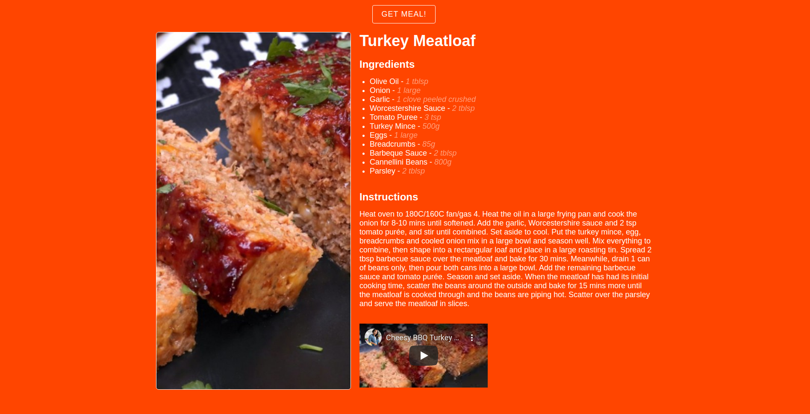

This is [Random Meal Generator](https://github.com/shinspiegel/app-ideas/blob/master/Projects/1-Beginner/Random-Meal-Generator.md) solution for the app ideas, located in the previous link.

It solves the following stories:

- [x] User can click a button that will get a random meal from an external API (see below)
- [x] The app should display: Recipe name, Ingredients, Instructions and a Picture of the meal
- [x] By clicking the button again, another meal will be generated
- [x] The app should display a YouTube Video

I used for this project [Parcel](https://parceljs.org/) as a bundler, and I did code in typescript to learn a thing or two. It was a good project, simple, quick and I did enjoy learning the basics of typescript.

Want to run in your machine? Cool!

**What you need?**

- [`git` link](https://git-scm.com/)
- [`npm` link](https://nodejs.org/en/)
- [`node` link](https://nodejs.org/en/)

**Did you get the requirements?**

Do you have everything installed in your machine?

**Ok,** time to clone this repository, so get in the terminal, navigate to your folder and...

```sh
# This will clone the repository
git clone https://github.com/shinspiegel/random-meal-generator.git shin-random-meal;

# This will navigate to the new cloned repository
cd shin-random-meal;

# This will install all the packages necessary to run this project.
npm install;

# This will run the script on the package.json file to start the development server
npm run dev
```

Once it started, open your [localhost:5050](http://localhost:5050) and click on the button!
